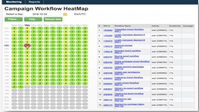
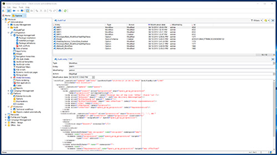
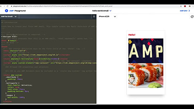

# Adobe Campaign Classic のチュートリアル - 概要

Adobe Campaign は、クロスチャネルのカスタマーエクスペリエンスを設計するためのプラットフォームとなり、視覚的なキャンペーンオーケストレーション、リアルタイムインタラクション管理、クロスチャネル実行のための環境を提供します。このユーザガイドには、Adobe Campaign Classic の数々の特長や機能に関するビデオとチュートリアルが含まれています。

## 新着情報

* **[GPG キー管理](/help/monitoring-campaign-classic/control-panel/gpg-key-management/gpg-key-management-overview.md)**

   *アウトバウンドデータを暗号化するために公開鍵と秘密鍵のペアを指定の[!UICONTROL Campaign]インスタンスに生成しインストールする方法と、インバウンドデータを復号化するために公開鍵を Campaign インスタンスにインポートしインストールする方法を説明します。*

* **[サブドメインのデリゲート（ベータ版）](/help/monitoring-campaign-classic/control-panel/subdomain-delegation.md)**

   *サブドメインを Adobe Campaign に完全にデリゲートする方法を説明します。*

* **[AMP を使用したインタラクティブな E メールコンテンツの定義](/help/sending-messages/email-channel/defining-interactive-email-content-with-amp.md)**

   *Adobe Campaign Classic（ACC）で AMP 形式の E メールコンテンツを設定する方法を説明します。*

## スタッフのおすすめ

<table>
<tr>
  <td>
    
    

      <a href="./monitoring-campaign-classic/workflow-heatmap.md">
    <strong>ワークフローヒートマップ</strong>
    </a>
    

    

    <em>並列ワークフロー数の概要を把握します。</em>
    

  </td>
   <td>
    
    

      <a href="./monitoring-campaign-classic/audit-trail.md">
    <strong>監査記録</strong>
    </a>
    
 
    

    <em>Adobe Campaign 内で発生するアクションとイベントの包括的なリストを記録します。</em>
    

  </td>
  <td>
    
    

      <a href="./sending-messages/email-channel/defining-interactive-email-content-with-amp.md">
    <strong>AMP を使用したインタラクティブな E メールコンテンツの定義</strong>
    </a>
    

    

    <em>Adobe Campaign ClassicでAMPをアクティブ化し、使用する方法を学びます </em>
    

  </td>
</tr>
</table>

## その他のリソース

* [ドキュメント](https://docs.adobe.com/content/help/ja-JP/campaign-classic/using/getting-started/starting-with-adobe-campaign/about-adobe-campaign-classic.html)
